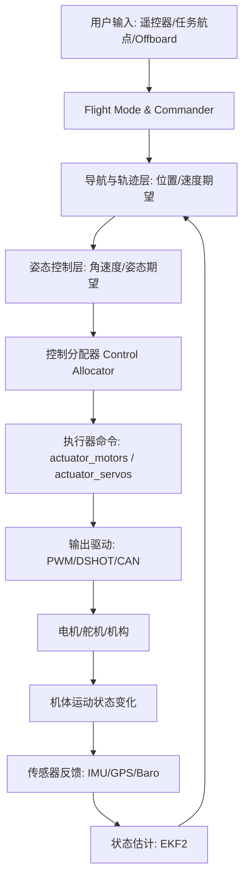
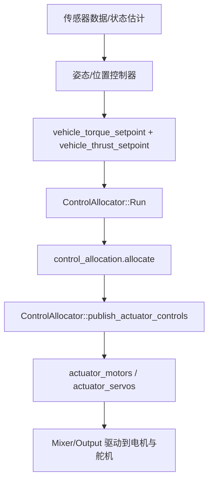
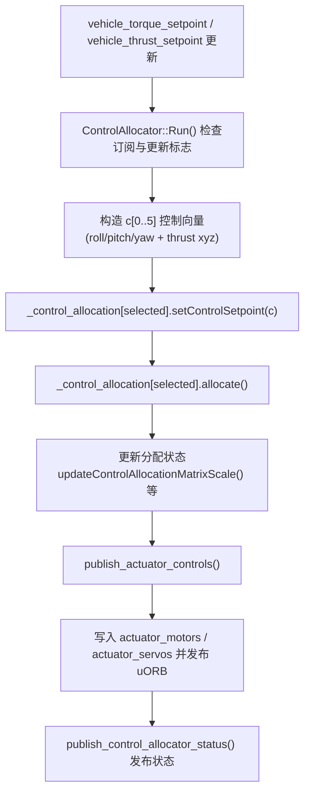
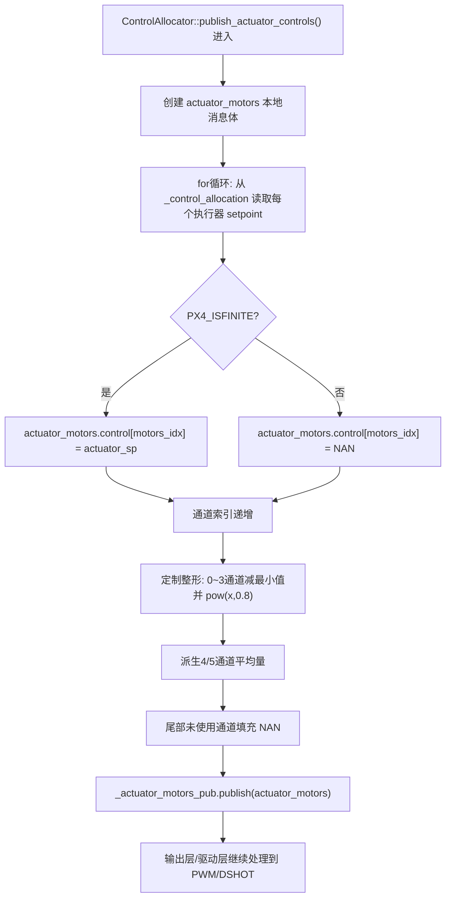
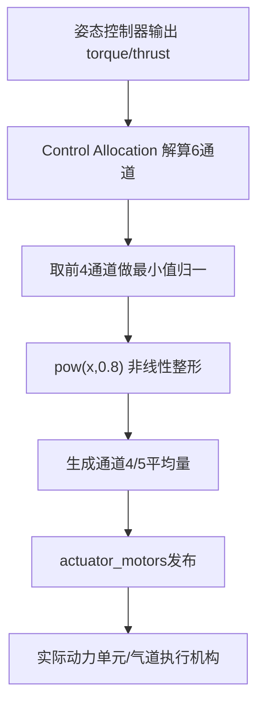

# PX4 项目软件开发说明（基于当前仓库）

## 1. 总体架构与运行主线

本仓库仍遵循 PX4 标准分层：

- **驱动/传感器层**：发布 IMU、GPS、气压计等 uORB 话题。
- **状态估计层**（如 EKF2）：融合传感器得到姿态、位置、速度估计。
- **控制层**：位置/姿态控制器生成力矩与推力需求。
- **控制分配层（Control Allocator）**：将 `torque/thrust setpoint` 分配到各执行器。
- **执行输出层**：发布 `actuator_motors` / `actuator_servos`，最终到 PWM/DSHOT。

你当前分支的核心定制发生在 **Control Allocator 输出整形** 与 **自定义机型（airframe 11001）参数定义**。

### 1.1 PX4 整体控制数据流流程图

---

## 2. PX4 原生控制流程（结合本仓库代码）

在 `ControlAllocator::Run()` 中，模块会订阅控制指令、处理失效策略、执行分配并发布执行器控制量，之后再输出状态。代码体现了“输入控制指令→分配→限幅→发布”的主循环。  

### 2.1 控制主循环流程图

### 2.2 数据流关键点

1. `Run()` 中由 `vehicle_torque_setpoint` 与 `vehicle_thrust_setpoint` 形成控制向量，再调用 `setControlSetpoint(...)` 写入分配器。  
2. `allocate()` 完成力矩/推力到执行器的解算。  
3. `publish_actuator_controls()` 将结果按电机/舵机通道发布，并处理反推、停转、失效与 NAN 填充。  

---

## 3. 你在仓库中的主要软件修改

根据提交历史，你的有效飞行相关修改集中在 `src/modules/control_allocator/ControlAllocator.cpp`。

### 3.1 修改点 A：增加数学函数依赖

你增加了 `#include <cmath>`，用于后续 `std::pow` 非线性映射。  

### 3.2 修改点 B：在 `publish_actuator_controls()` 中加入定制整形

你在电机输出发布阶段，对 0~3 号通道先做“去公共量（减最小值）”，再做指数映射 `pow(x, 0.8)`；同时将第 4、5 通道设置为前后对平均值（由前四通道组合得来）。

这意味着你的分配后输出不是直接下发，而是经过“**差分提取 + 非线性压缩**”的二次映射，目的可理解为：

- 保留姿态差分控制成分；
- 对小/中幅度指令进行增益再分布（0.8 次幂会改变曲线形状）；
- 用第 4、5 通道承接组合量，适配你的特殊动力/气道结构。

### 3.3 修改点 C：逻辑触发条件处理

代码中原条件判断被注释，当前该整形块处于“始终执行”的样式（通过注释保留了历史条件）。这对后续维护有影响：

- 优点：调试阶段可快速验证改动效果；
- 风险：若切换到其它机型，可能误套用该输出整形。

建议后续用参数开关（如 `CA_CUSTOM_MODE`）恢复显式条件门控。

### 3.4 `actuator_motors.control` 数组处理流程图

下面专门给出 `actuator_motors.control[]` 的数据生命周期（从初始赋值到发布）：

对应代码含义可概括为：

1. **初始写入点**：在 `publish_actuator_controls()` 的电机循环中，把分配器输出逐项写入 `actuator_motors.control[motors_idx]`。  
2. **有效性处理**：若 setpoint 非有限值，则写入 `NAN`，避免非法值进入输出链路。  
3. **二次整形**：在你当前分支中，写入后对前四通道执行差分+非线性映射，并重算 4/5 通道。  
4. **发布前补齐**：把剩余未使用槽位填 `NAN`，最后 publish 到 uORB `actuator_motors`。  

---

## 4. 你定义的新机型（Airframe）说明

你新增了 `ROMFS/px4fmu_common/init.d/airframes/11001_hexa_cox`，机型名为 **Generic Hexarotor coaxial geometry**，类型 `Hexarotor Coaxial`。其参数表现为“6 电机框架 + 前四通道主控 + 后两通道占位/辅助”的混合配置。

### 4.1 参数结构解读

- `MAV_TYPE=13`（多旋翼类型）。
- `CA_ROTOR_COUNT=6`。
- Rotor0~3 定义了有效几何位置与反扭矩系数（`PX/PY/KM`）。
- Rotor4~5 被设置在原点，且 `CT/KM=0`，更像占位或备用通道。

这与上面的 `ControlAllocator.cpp` 定制逻辑形成呼应：你在软件侧把前四通道做差分/非线性后，再派生第 4、5 通道。

### 4.2 新机型控制数据流（你当前实现）

---

## 5. 面向后续开发的实施建议

1. **参数化开关**：将定制整形逻辑受参数控制，避免影响非目标机型。  
2. **机型专属映射模块化**：把当前 `publish_actuator_controls()` 中的特殊映射抽成函数或策略类。  
3. **回归验证**：至少增加 SITL/日志对比，验证姿态误差、油门利用率、饱和率。  
4. **文档对齐**：在 airframe 注释中明确 4/5 通道的物理含义（当前从参数看是“非典型 6 旋翼”定义）。

---

## 6. 与仓库文档/提交的一致性说明

- README 末尾增加了工程标记 `# px4_v1.16`。  
- 历史提交显示你的飞行验证节点为 `first_test_flight`、`first_successful_flight`、`last_successful_flight`，与本说明中“先定义机型、后迭代控制分配输出”的开发路径一致。
